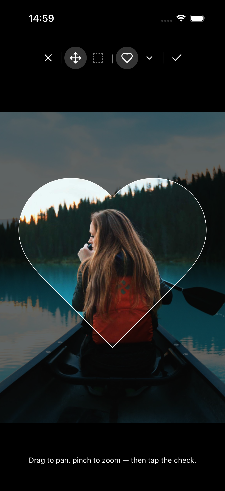
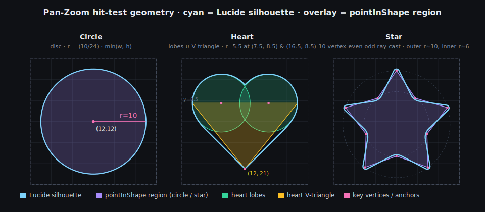
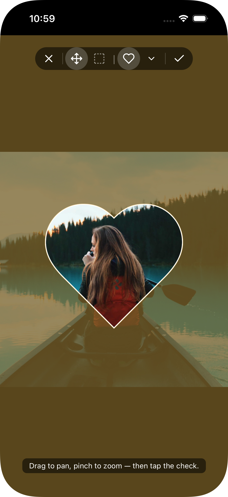
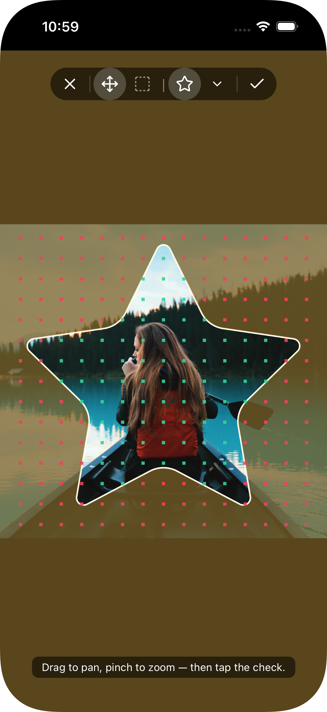
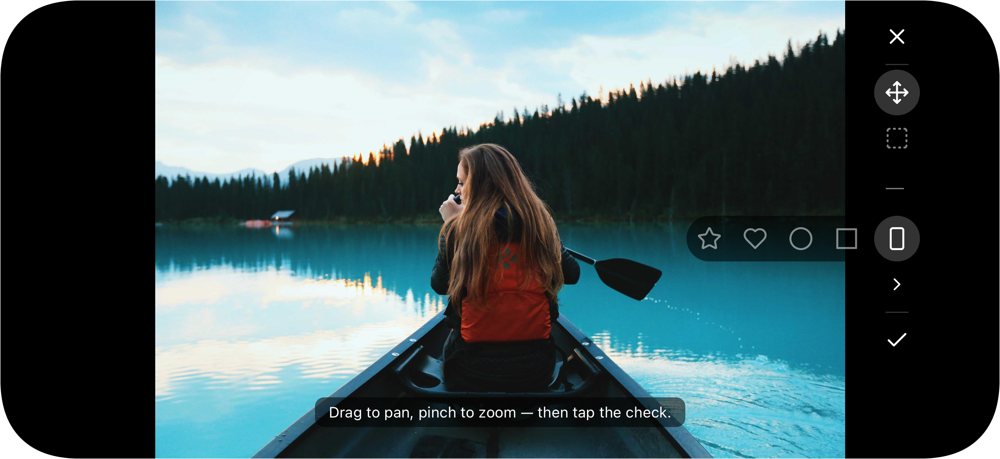
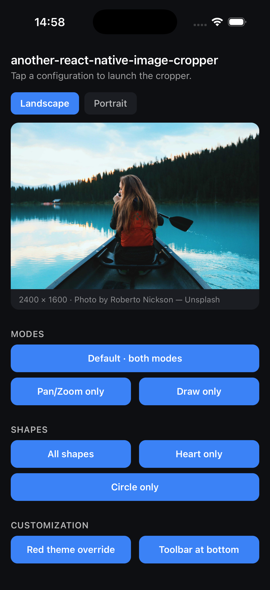

<div align="center">

# another-react-native-image-cropper

**Shape-aware, gesture-first image crop UI for React Native.**

Pan-zoom or draw-to-crop. Free or locked aspect ratios. Built on
Reanimated 3+ worklets so every gesture stays on the UI thread at 60 fps.

The headline feature is the **shape system**: crop into a rectangle, a
circle, a heart, a star, or your own SVG path. The dim overlay uses the
shape itself as a cutout mask, not just a rectangular window.

[Why](#why-i-built-this) · [Shapes](#shapes) · [Install](#install) · [Usage](#usage) · [Props](#props) · [Requested Features](#requested-features)

<br />


</div>

---

## Why I built this

None of the existing React Native crop libraries quite fit what I
needed, so here's another. Hopefully it fits what you need too.

## Shapes

The shape system is the design centerpiece. Five built-ins plus a
wishlist entry for consumer-registered shapes:

| Shape | Aspect |
| --- | --- |
| Rectangle | free or locked via `aspectRatio` |
| Square | 1:1 locked |
| Circle | 1:1 locked |
| Heart | ~1:1 locked |
| Star | 1:1 locked |
| Custom (`defineShape()`) — [wishlist](#requested-features) | any |

```tsx
import {
  ImageCropperModal,
  builtInShapes,
  heartShape,
} from 'another-react-native-image-cropper';

// Offer all four shapes
<ImageCropperModal shapes={builtInShapes} defaultShape="heart" {...} />

// Lock a single shape
<ImageCropperModal shapes={[heartShape]} {...} />
```

A locked aspect ratio drives different interactions per mode:

- **Pan-Zoom** — one finger inside the shape pans the image; one finger
  outside the shape silhouette resizes the crop frame (radial-from-center).
  Two-finger pinch zooms the image inside the shape and resizes the crop
  outside. The shape stays centered and the aspect ratio is preserved.
- **Draw** — corner-handle drag resizes omnidirectionally so the shape
  stays geometrically correct. Two-finger pan/pinch moves the image
  underneath.

<div align="center">
  
  &nbsp;&nbsp;
  
  <br />
  <em>Pan-Zoom resize via dim-area pinch (left) · Draw mode corner drag (right)</em>
</div>

Both modes render the dim overlay as an SVG `<Mask>` with the shape path
as a cutout. In Draw mode the cutout follows the selection rect in
real time as the user drags a corner. In Pan-Zoom it tracks the mask's
gesture-driven scale.

#### Shape-aware hit testing

Pan-Zoom needs to decide *per touch* whether the finger landed inside
the shape silhouette (→ pans the image) or outside (→ resizes the crop
frame). Each `Shape` ships a tiny worklet, `pointInShape(x, y, w, h)`,
that runs on the UI thread. `(x, y)` is the touch
in bbox-local coordinates; `w` and `h` are the **live** frame
dimensions, so the hit region scales automatically as the user resizes.

Built-ins decompose their silhouettes into closed-form primitives, zero allocation per
touch, pixel-stable:

<div align="center">
  
</div>

Rectangle and square omit `pointInShape` and fall back to a bbox test
(correct — they fill their bbox). A custom `Shape` can either provide
its own worklet (must be annotated `'worklet'`) or omit the field and
accept the bbox fallback. See [`src/shapes/builtins.ts`](./src/shapes/builtins.ts)
for reference implementations, and flip `debug: 'grid'` to visualise
your worklet's output live (green / red dot per grid sample).

Built-in shape paths are sourced from [Lucide](https://lucide.dev) (ISC). See [NOTICE](./NOTICE) for attribution.

## Install

```sh
yarn add another-react-native-image-cropper
# Peer dependencies — install if you don't already have them:
yarn add react-native-reanimated react-native-gesture-handler \
  react-native-safe-area-context react-native-svg \
  @react-native-community/image-editor
```

Optional — only needed when you use `outputMask` for shape-masked output:

```sh
yarn add @shopify/react-native-skia
```

Then on iOS:

```sh
cd ios && pod install
```

If you're on Reanimated 4, make sure `react-native-worklets/plugin` is the
**last** entry in your `babel.config.js` plugins. On Reanimated 3 use
`react-native-reanimated/plugin` instead.

## Usage

```tsx
import {
  ImageCropperModal,
  type CropResult,
} from 'another-react-native-image-cropper';
import React, { useState } from 'react';
import { Button } from 'react-native';

export function CropExample() {
  const [open, setOpen] = useState(false);
  const [result, setResult] = useState<CropResult | null>(null);

  return (
    <>
      <Button title="Crop" onPress={() => setOpen(true)} />

      <ImageCropperModal
        visible={open}
        sourceUri="file:///path/to/image.jpg"
        sourceWidth={2400}
        sourceHeight={1600}
        labels={{
          cancel: 'Cancel',
          confirm: 'Done',
          instructions: 'Drag to pan, pinch to zoom.',
          errorMessage: 'Could not crop this image.',
        }}
        onConfirm={(r) => {
          setResult(r);
          setOpen(false);
        }}
        onCancel={() => setOpen(false)}
        onError={(err) => console.warn('crop failed', err)}
      />
    </>
  );
}
```

The modal expects a **local file URI** plus the image's natural pixel
dimensions. Those are required for the geometry math to work correctly.
Most pickers (`react-native-image-picker`, `expo-image-picker`,
`@react-native-camera-roll/camera-roll`) return both.

### Shape-masked output

The native crop is always a rectangle - `@react-native-community/image-editor`
has no concept of shape. To get a PNG that honours the active shape
(transparent outside the silhouette, optional stroke on the outline),
pass `outputMask`:

```tsx
<ImageCropperModal
  // …required props
  shapes={builtInShapes}
  defaultShape="heart"
  outputMask={{
    color: 'transparent', // or any RN color, e.g. '#1A1A1A'
    stroke: { color: '#FFFFFF', width: 2 }, // optional
  }}
  onConfirm={(r) => {
    // r.uri is a `data:image/png;base64,...` string — render directly:
    //   <Image source={{ uri: r.uri }} />
    // …or strip the prefix and write to a file with your fs lib:
    //   const base64 = r.uri.replace(/^data:image\/png;base64,/, '');
    //   await RNFS.writeFile(path, base64, 'base64');
  }}
/>
```

`outputMask` requires `@shopify/react-native-skia`. Install it as a peer
only when you use this prop. The output is always PNG (alpha channel is
needed for transparent cutouts). For standard rectangular crops the
returned `uri` is a regular `file://` path.

<div align="center">
  
  <br />
  <em>End-to-end: heart crop → masked PNG with transparent fill + white stroke.</em>
</div>

### Shape-cutout output

Use `outputCutout` when you want the PNG itself to be shape-sized —
trimmed to the shape's tight bounding box, not the framed crop rect.
Distinct from `outputMask` (which keeps the crop-rect dimensions);
mutually exclusive with it.

```tsx
<ImageCropperModal
  // …required props
  shapes={builtInShapes}
  defaultShape="heart"
  outputCutout={{
    color: 'transparent',                   // fill outside the silhouette
    stroke: { color: '#FFFFFF', width: 2 }, // optional outline
    padding: 4,                             // optional extra margin
  }}
  onConfirm={(r) => {
    // r.uri is `data:image/png;base64,...`.
    // Render directly:  <Image source={{ uri: r.uri }} />
  }}
/>
```

Skip the base64 step entirely by providing `onBytes` — the library
hands you the composited PNG buffer, and whatever URI you return
becomes `CropResult.uri`:

```tsx
outputCutout={{
  onBytes: async (bytes, { width, height }) => {
    const path = `${RNFS.CachesDirectoryPath}/crop-${Date.now()}.png`;
    await RNFS.writeFile(path, Buffer.from(bytes).toString('base64'), 'base64');
    return `file://${path}`;
  },
}}
```

`outputCutout` requires `@shopify/react-native-skia` — the same
optional peer `outputMask` uses. No-op for the free-aspect rectangle
and for custom shapes that use a function-form mask.

## Props

### Required

| Prop | Type | Description |
| --- | --- | --- |
| `visible` | `boolean` | Controls modal visibility. |
| `sourceUri` | `string` | Local file URI of the image to crop. |
| `sourceWidth` | `number` | Natural pixel width of the source image. |
| `sourceHeight` | `number` | Natural pixel height of the source image. |
| `labels` | `ImageCropperLabels` | UI strings - pass your own translations. |
| `onConfirm` | `(r: CropResult) => void` | Called with the cropped file URI + dimensions. |
| `onCancel` | `() => void` | Called when the user dismisses without cropping. |

### Modes & shapes

| Prop | Type | Description |
| --- | --- | --- |
| `modes?` | `CropMode[]` | Enabled interaction modes. Defaults to `['pan-zoom', 'draw']`. A single entry hides the picker. |
| `defaultMode?` | `CropMode` | Active mode on open. Defaults to `modes[0]`. |
| `onModeChange?` | `(m) => void` | Fires when the user toggles modes. |
| `shapes?` | `Shape[]` | Available shapes. Omit to stay on the rectangular default. |
| `defaultShape?` | `Shape \| string` | Active shape (instance or `id`). Defaults to `shapes[0]`. |
| `onShapeChange?` | `(s) => void` | Fires when the user picks a different shape. |
| `aspectRatio?` | `number` | Frame aspect (`width / height`). Overridden by the active shape's `aspectRatio` when a locked-ratio shape is active. |
| `framePadding?` | `number` | Fraction of the container reserved as margin on each side of the crop rect when an aspect ratio or shape is active. Range `[0, 0.5)`; default `0.06`. Overridden by the active shape's `framePadding` when set (e.g. `squareShape` uses `0.15`). |

### Output

| Prop | Type | Description |
| --- | --- | --- |
| `maxOutputSize?` | `number` | Cap on the longer edge of the cropped image (px). |
| `outputQuality?` | `number` | JPEG quality in `[0, 1]`. Ignored for PNG. |
| `outputFormat?` | `'jpeg' \| 'png'` | Output file format for the rect crop. Defaults to `'jpeg'`. Forced to PNG when `outputMask` or `outputCutout` is set. |
| `outputMask?` | `OutputMask` | Post-process the crop with a shape-mask composite. Full crop-rect size; pixels outside the shape get `color` (default transparent), optional `stroke` on the silhouette. Returns a base64 PNG data URI. Requires `@shopify/react-native-skia`. No-op for the free rectangle. |
| `outputCutout?` | `OutputCutout` | Post-process the crop into a PNG trimmed to the shape's tight bbox, alpha-transparent outside the silhouette. Same `color` / `stroke` knobs as `outputMask` plus `padding` and an optional `onBytes` callback that hands the raw PNG buffer to your persistence layer. Mutually exclusive with `outputMask`. No-op for the free rectangle. Requires `@shopify/react-native-skia`. |
| `onError?` | `(err: unknown) => void` | Called when the underlying crop call rejects. |

### Customization

| Prop | Type | Description |
| --- | --- | --- |
| `theme?` | `DeepPartial<Theme>` | Deep-merged onto `defaultTheme`. Pass any subset. |
| `icons?` | `Partial<Record<IconName, ReactNode \| (p) => ReactNode>>` | Per-icon override. Falls back to Lucide paths. |
| `toolbarPosition?` | `'auto' \| 'top' \| 'bottom' \| 'left' \| 'right' \| 'hidden'` | Placement. `'hidden'` → drive via the imperative ref. |
| `showFooter?` | `boolean` | Hide the instruction/error pill. Default `true`. |
| `frameStyle?` | `FrameStyle` | Border width / color / radius overrides. |
| `handleStyle?` | `HandleStyle` | Draw-mode corner handle — arm length / thickness / color / hit size. |
| `debug?` | `boolean \| 'tint' \| 'grid'` | Visualizes interaction hit regions. `true` / `'tint'` — amber tint in the outside-silhouette region (Pan-Zoom) and tinted move handle (Draw). Cheap. `'grid'` — additionally samples `Shape.pointInShape(...)` on a 15×15 grid inside the live frame bbox, rendering green (inside) / red (outside) markers. Useful when authoring a new shape; heavier on Android. Off by default. |
| `renderToolbar?` | `(p: ToolbarRenderProps) => ReactNode` | Full toolbar replacement. |
| `renderFooter?` | `(p: FooterRenderProps) => ReactNode` | Full footer replacement. |

<div align="center">
  
  &nbsp;&nbsp;
  
  <br />
  <em><code>debug: true</code> / <code>'tint'</code> (left) - amber tint in the outside-silhouette region (where the Pan-Zoom resize gesture activates). <code>debug: 'grid'</code> (right) - tint plus a sample grid of <code>Shape.pointInShape</code> results (green = inside, red = outside) for worklet ground-truth when authoring new shapes.</em>
</div>

<div align="center">
  
  <br />
  <em><code>toolbarPosition: 'auto'</code> - top-center in portrait, right edge in landscape.</em>
</div>

### Imperative ref

Forward a ref of type `ImageCropperHandle` when `toolbarPosition='hidden'`:

```tsx
const ref = useRef<ImageCropperHandle>(null);
// ...
<ImageCropperModal ref={ref} toolbarPosition="hidden" {...} />
<Button onPress={() => ref.current?.confirm()} title="Done" />
```

The handle exposes `confirm()` (returns a Promise), `cancel()`, and
`setMode(mode)`.

## Try it locally

```sh
git clone https://github.com/likrot/another-react-native-image-cropper
cd another-react-native-image-cropper
yarn install
yarn example pods    # iOS only
yarn example ios     # or: yarn example android
```

The example app exercises every config: mode variants, each
shape, customization overrides, PNG + masked output. Toggle the
source between landscape and portrait to verify both orientations.

<div align="center">
  
</div>

## Requested Features

Wishlist items - not committed, open an issue if you want to champion
one:

- [ ] **Custom shapes via `defineShape()`** - the `Shape` protocol is already
  public; the helper would be a thin validator + registry wrapper over
  what you can already pass through `shapes` today.
- [ ] **Free-form drawing mode** - user traces a custom crop boundary by hand.
- [ ] **Rotation** - rotate the source image before cropping.
- [ ] **Aspect ratio presets** - 16:9, 4:3, etc., independent of shapes.

## Credits

- Project bootstrapped with
  [callstack/react-native-builder-bob](https://github.com/callstack/react-native-builder-bob).
- Toolbar and shape icons from [Lucide](https://lucide.dev), licensed under
  ISC. Full attribution in [NOTICE](./NOTICE).
- Native crop step from
  [`@react-native-community/image-editor`](https://github.com/callstack/react-native-image-editor).

## License

[MIT](./LICENSE) © likrot
